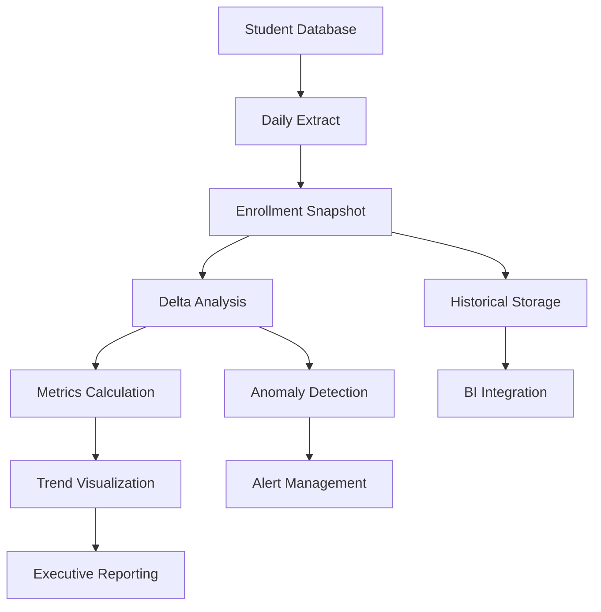

# Enrollment Analytics Pipeline

A production-ready time-series analytics pipeline for tracking student enrollment changes, generating operational intelligence, and providing predictive insights for educational institutions.

## 🎯 Overview

This pipeline demonstrates advanced **time-series analytics** and **operational intelligence** patterns, processing daily enrollment snapshots to provide:

- **Real-time enrollment monitoring** with automated change detection
- **Retention analysis** and trend forecasting for institutional planning
- **Professional visualizations** for executive reporting and stakeholder communication
- **Data quality monitoring** and anomaly detection
- **BI-ready outputs** for integration with Power BI, Tableau, and other analytics tools

## 📊 Key Features

### **Time-Series Analytics**
- Daily enrollment snapshot processing with delta detection
- Student add/drop tracking using efficient set operations
- Retention rate calculations and trending over time
- Anomaly detection for unusual enrollment patterns

### **Operational Intelligence** 
- Automated reporting to enrollment leadership
- Professional chart generation with institutional branding
- Email notifications with rich HTML formatting
- Integration-ready CSV outputs for downstream analytics

### **Production Engineering**
- Modular Airflow TaskFlow API implementation
- Comprehensive error handling and graceful degradation
- Configurable batch processing and data retention
- Professional logging and monitoring capabilities

## 🏗️ Architecture



### **Core Components**

1. **EnrollmentTracker**: Main DAG orchestrating the analytics pipeline
2. **EnrollmentAnalytics**: Core analytics engine for snapshot comparison and metrics
3. **ChartGenerator**: Professional visualization with smart formatting
4. **Configuration Management**: YAML-based configuration with environment overrides

## 🚀 Quick Start

### **Prerequisites**

- Apache Airflow 2.8+
- PostgreSQL/SQL Server/MySQL for student data
- Python 3.9+ with pandas, matplotlib
- SMTP server for email notifications (optional)

### **Installation**

```bash
# Clone the repository
git clone https://github.com/teeeven/enrollment-analytics-pipeline.git
cd enrollment-analytics-pipeline

# Install dependencies
pip install -r requirements.txt

# Copy to Airflow DAGs directory
cp src/enrollment_tracker.py /path/to/airflow/dags/
```

### **Configuration**

1. **Set Airflow Variables:**
```bash
# Required variables
airflow variables set ENROLLMENT_DB_CONN_ID "your_database_connection"
airflow variables set ENROLLMENT_SQL_QUERY "$(cat sql/enrollment_query.sql)"
airflow variables set ENROLLMENT_EMAIL_RECIPIENTS "admin@university.edu,registrar@university.edu"

# Optional customization
airflow variables set INSTITUTION_NAME "Your University"
airflow variables set ENROLLMENT_SEMESTER "Fall 2024"
airflow variables set ENROLLMENT_OUTPUT_DIR "/opt/airflow/data/enrollment"
```

2. **Create Database Connection:**
```bash
# PostgreSQL example
airflow connections add student_db_conn \
    --conn-type postgres \
    --conn-host localhost \
    --conn-login username \
    --conn-password password \
    --conn-schema student_db
```

3. **Customize SQL Query:**
Edit `sql/enrollment_query.sql` to match your database schema:
```sql
SELECT 
    student_id,
    student_name,
    division,
    program,
    level
FROM your_enrollment_table
WHERE semester = 'Current'
  AND status = 'Active'
```

### **Testing with Sample Data**

Use the provided sample data to test the pipeline:

```bash
# Copy sample data to your output directory
cp examples/sample_data/* /opt/airflow/data/enrollment/

# Run the DAG manually in Airflow UI
# or trigger via CLI:
airflow dags trigger enrollment_analytics_pipeline
```

## 📈 Analytics Capabilities

### **Daily Snapshot Analysis**
- **Delta Detection**: Identifies new enrollments and withdrawals using set operations
- **Retention Calculation**: Tracks student persistence rates over time
- **Trend Analysis**: Linear regression and moving averages for forecasting

### **Professional Visualizations**
- **Enrollment Trend Charts**: Time-series with smart date formatting
- **Daily Change Analysis**: Bar charts showing adds/drops patterns
- **Retention Rate Tracking**: Trend lines with target benchmarks
- **Executive Dashboards**: Multi-panel summaries for leadership

### **Operational Reporting**
- **Email Notifications**: Rich HTML reports with embedded metrics
- **Student Change Lists**: Detailed add/drop information for follow-up
- **Data Quality Alerts**: Monitoring for unusual patterns or data issues

## 🔧 Advanced Configuration

### **Custom Analytics**

```python
# Add custom metrics to EnrollmentAnalytics
class CustomEnrollmentAnalytics(EnrollmentAnalytics):
    def calculate_program_metrics(self, df):
        """Calculate enrollment by academic program."""
        return df.groupby('program').size().to_dict()
    
    def detect_risk_patterns(self, metrics_df):
        """Identify at-risk enrollment patterns."""
        # Custom risk detection logic
        pass
```

### **Integration Patterns**

```python
# Power BI Integration
@task
def export_for_powerbi(metrics_file: str) -> str:
    """Export data in Power BI-optimized format."""
    df = pd.read_csv(metrics_file)
    
    # Add Power BI-friendly columns
    df['YearMonth'] = pd.to_datetime(df['date']).dt.to_period('M')
    df['DayOfWeek'] = pd.to_datetime(df['date']).dt.day_name()
    
    # Export for Power BI consumption
    powerbi_file = "enrollment_powerbi_export.csv"
    df.to_csv(powerbi_file, index=False)
    return powerbi_file
```

### **Machine Learning Extension**

```python
# ML Forecasting (separate DAG)
@task  
def generate_enrollment_forecast(metrics_file: str) -> Dict[str, Any]:
    """Generate ML-based enrollment forecasts."""
    from sklearn.linear_model import LinearRegression
    
    df = pd.read_csv(metrics_file)
    # Implement forecasting logic
    return forecast_results
```

## 📊 Business Impact

### **For Enrollment Leadership**
- **Proactive Monitoring**: Daily insights into enrollment patterns
- **Capacity Planning**: Trend analysis for resource allocation  
- **Risk Management**: Early warning system for enrollment drops
- **Data-Driven Decisions**: Quantitative insights for policy changes

### **For Institutional Research**
- **Retention Analysis**: Longitudinal student persistence tracking
- **Predictive Modeling**: Foundation for enrollment forecasting models
- **Benchmarking**: Historical trends for comparative analysis
- **Compliance Reporting**: Automated data collection for regulatory requirements

### **Quantifiable Benefits**
- **Time Savings**: 2-3 hours daily of manual enrollment analysis
- **Early Detection**: 24-48 hour earlier identification of enrollment issues
- **Decision Speed**: Real-time data reduces planning cycle time
- **Accuracy Improvement**: Automated processing reduces human error

## 🎓 Educational Use Cases

### **Academic Planning**
- **Course Capacity**: Enrollment trends inform class scheduling
- **Resource Allocation**: Staffing and facility planning based on projections  
- **Program Evaluation**: Track program-specific enrollment health
- **Budget Forecasting**: Enrollment-based revenue projections

### **Student Success**
- **Early Intervention**: Identify at-risk cohorts for support programs
- **Retention Strategies**: Data-driven approach to student persistence
- **Outreach Targeting**: Demographic analysis for recruitment focus
- **Alumni Analytics**: Long-term enrollment pattern analysis

## 🔍 Data Model

### **Core Entities**

```sql
-- Daily enrollment snapshots
enrollment_snapshots (
    snapshot_date DATE,
    student_id VARCHAR,
    student_name VARCHAR,
    division VARCHAR,
    program VARCHAR,
    level VARCHAR
);

-- Historical metrics for trending
enrollment_metrics (
    date DATE,
    total_enrollment INT,
    new_students INT,
    dropped_students INT,
    net_change INT,
    retention_rate DECIMAL(5,2)
);
```

### **Analytics Views**

```sql
-- Weekly enrollment summary
CREATE VIEW weekly_enrollment_summary AS
SELECT 
    DATE_TRUNC('week', date) as week_start,
    AVG(total_enrollment) as avg_enrollment,
    SUM(new_students) as weekly_adds,
    SUM(dropped_students) as weekly_drops,
    AVG(retention_rate) as avg_retention
FROM enrollment_metrics
GROUP BY DATE_TRUNC('week', date);
```

## 📋 Implementation Checklist

### **Phase 1: Basic Setup**
- [ ] Configure database connection in Airflow
- [ ] Customize SQL query for your schema
- [ ] Set required Airflow Variables
- [ ] Test with sample data
- [ ] Verify email notifications

### **Phase 2: Production Deployment**
- [ ] Schedule daily execution (8 AM recommended)
- [ ] Set up monitoring and alerting
- [ ] Configure data retention policies  
- [ ] Train stakeholders on reports
- [ ] Document operational procedures

### **Phase 3: Advanced Analytics**
- [ ] Implement custom metrics for your institution
- [ ] Add program/department-specific analysis
- [ ] Integrate with BI tools (Power BI, Tableau)
- [ ] Develop forecasting capabilities
- [ ] Create executive dashboards

## 🚨 Troubleshooting

### **Common Issues**

**1. Database Connection Failures**
```bash
# Test connection
airflow connections test student_db_conn

# Check query syntax
airflow variables get ENROLLMENT_SQL_QUERY | psql -h host -d db -f -
```

**2. Missing Data Issues**
```python
# Add data validation task
@task
def validate_enrollment_data(df: pd.DataFrame) -> bool:
    assert len(df) > 0, "No enrollment data found"
    assert 'student_id' in df.columns, "Missing student_id column"
    return True
```

**3. Chart Generation Problems**
```bash
# Install matplotlib dependencies
pip install matplotlib seaborn

# Check file permissions
ls -la /opt/airflow/data/enrollment/reports/
```

## 📚 Additional Resources

- **Time-Series Analysis**: [ARIMA Forecasting Tutorial](docs/forecasting_guide.md)
- **Power BI Integration**: [BI Integration Guide](docs/powerbi_integration.md)  
- **Custom Analytics**: [Analytics Extension Guide](docs/custom_analytics.md)
- **Production Deployment**: [Operations Guide](docs/operations_guide.md)

## 🌐 Cross-Industry Applications

While designed for enrollment analytics, this pipeline architecture demonstrates **transferable patterns** that apply across industries. The core framework of time-series monitoring, delta detection, and automated reporting creates value in numerous business contexts:

### **Retail & E-Commerce**
**Customer Acquisition & Retention Analytics**
- **Metric Translation**: Enrollment → Active Customers, Students → Customer Accounts
- **Use Cases**: Daily customer acquisition tracking, churn detection, seasonal trend analysis
- **Business Value**: Inventory planning, marketing optimization, customer lifetime value analysis

```python
# Example: Customer Analytics Pipeline
customer_analytics = CustomerAnalytics()
metrics = customer_analytics.compare_snapshots(
    baseline_customers=yesterday_active_customers,
    current_customers=today_active_customers
)
# Output: new_customers, churned_customers, retention_rate, growth_rate
```

### **Financial Services**
**Portfolio & Client Management**
- **Metric Translation**: Enrollment → Account Holdings, Students → Client Portfolios  
- **Use Cases**: Client onboarding rates, portfolio changes, asset allocation shifts
- **Business Value**: Risk management, client retention, regulatory compliance reporting

### **Software as a Service (SaaS)**
**User Engagement & Feature Adoption**
- **Metric Translation**: Enrollment → Active Users, Students → Feature Adopters
- **Use Cases**: Daily/monthly active user tracking, feature rollout analysis, subscription analytics
- **Business Value**: Product development insights, customer success optimization, pricing strategy

### **Sports & Entertainment**
**Fan Engagement & Team Management**
- **Metric Translation**: Enrollment → Season Ticket Holders, Students → Fan Participants
- **Use Cases**: Attendance tracking, fan engagement patterns, membership renewals, performance trends
- **Business Value**: Revenue forecasting, marketing campaign effectiveness, facility utilization

### **Healthcare Operations**
**Patient Engagement & Provider Analytics**
- **Metric Translation**: Enrollment → Patient Census, Students → Active Patients
- **Use Cases**: Patient admission/discharge patterns, provider utilization, care program participation
- **Business Value**: Capacity planning, quality metrics, operational efficiency

### **Manufacturing & Supply Chain**
**Workforce & Production Analytics**
- **Metric Translation**: Enrollment → Active Workforce, Students → Production Units
- **Use Cases**: Employee headcount tracking, shift analysis, production capacity monitoring
- **Business Value**: Labor optimization, demand forecasting, efficiency improvements

### **Universal Architecture Patterns**

This pipeline demonstrates **core analytics engineering principles** that scale across domains:

#### **1. Time-Series Delta Detection**
```python
# Universal Pattern: Compare Any Two Snapshots
def compare_snapshots(baseline_entities, current_entities):
    """Works for customers, patients, employees, products, etc."""
    baseline_ids = set(baseline_entities.keys())
    current_ids = set(current_entities.keys()) 
    
    return {
        'added': current_ids - baseline_ids,
        'removed': baseline_ids - current_ids,
        'retained': baseline_ids & current_ids,
        'retention_rate': len(retained) / len(baseline_ids) * 100
    }
```

#### **2. Automated Reporting & Alerting**
- **Anomaly Detection**: Statistical thresholds for unusual changes
- **Executive Dashboards**: Professional visualizations for stakeholder communication  
- **Operational Alerts**: Automated notifications for threshold breaches
- **Trend Forecasting**: Predictive insights for strategic planning

#### **3. Modular Pipeline Architecture**
- **Configurable Data Sources**: Database connections, APIs, file systems
- **Pluggable Analytics**: Custom metrics and business logic
- **Flexible Outputs**: Email reports, dashboards, API endpoints, data warehouse integration

### **Implementation Strategy for Other Domains**

1. **Identify Core Entities**: What are you tracking? (customers, transactions, users, products)
2. **Define Key Metrics**: What changes matter? (growth, churn, utilization, efficiency)  
3. **Configure Data Sources**: Where is your data? (CRM, ERP, databases, APIs)
4. **Customize Analytics**: What insights drive decisions? (trends, anomalies, forecasts)
5. **Design Stakeholder Reports**: Who needs what information? (executives, operations, analysts)

### **Technical Transferability**

The pipeline's **technical stack** is industry-agnostic:

- **Apache Airflow**: Orchestration works for any scheduled analytics workflow
- **Pandas + Python**: Data processing applies to any structured dataset  
- **Time-Series Analysis**: Statistical methods work across all temporal data
- **Professional Visualization**: Chart generation serves any reporting need
- **Email Integration**: Stakeholder communication scales to any organization

---

**Why This Matters**: This project showcases **architectural thinking** and **pattern recognition** - demonstrating ability to design reusable solutions that solve similar problems across different business contexts. The enrollment use case provides a concrete example, but the underlying framework is a versatile analytics engine.

## 🤖 AI Collaboration & Transparency

I believe in **transparency and thoughtful craft**. Many of the ideas and solutions in this project were refined with the help of AI collaborators like ChatGPT and Claude—used for pair programming, architecture review, documentation polishing, and following best practices.

I often use these tools to help define the smallest viable units of work, acting as a second set of eyes to decompose complex systems into testable, atomic components. They also support a **test-driven development (TDD) mindset**—encouraging deliberate structure, validation-first thinking, and composable patterns.

**These tools don't replace the work—they support it.** Every commit reflects my judgment, iteration, and care. I treat AI as part of my toolkit: as an apprentice in the studio, it is invited to shape—but never define—the final form.

This is what **modern craftsmanship** looks like to me: curious, collaborative, and open about the tools we use to build with care.

## 🤝 Contributing

This pipeline is designed to be extensible and customizable:

1. **Custom Metrics**: Add institution-specific analytics
2. **Visualization**: Create custom chart types and dashboards
3. **Integration**: Build connectors to additional systems
4. **ML Extensions**: Implement forecasting and prediction models

## 📄 License

MIT License - see [LICENSE](LICENSE) file for details.

---

**Portfolio Note**: This pipeline demonstrates advanced **analytics engineering** capabilities, combining production data engineering with statistical analysis and business intelligence. It showcases skills in time-series processing, operational intelligence, and stakeholder communication - key competencies for senior data roles in higher education and beyond.